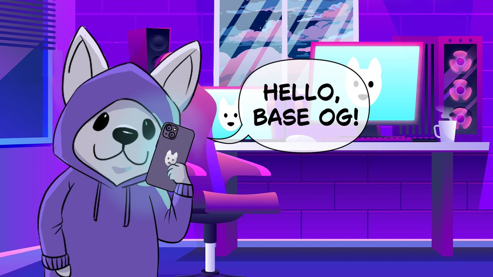

## FARCASTER DOG BOT



**FarcasterDog Memecoin on Farcaster Airdrop**

If you have warpcast account, you can claim $FDOG that calculated by your accounts age on warpcast.
Link : [HERE](https://farcasterdog.xyz)
- Login Warpcast and the link
- Check "Farcaster Contributor" to earn $FDOG
- Complete all social task
- Done!

But if you don't have warpcast, You can join warpcast first [Here](https://warpcast.com) , it still worth to create a warpcast/farcaster accounts. 
- Create Warpcast Account
- Link your wallet on settings > verified address (Connect new wallet that will be used for warpcast / BURNER)
- Open the link and earn $FDOG from daily task

Details : [Twitter](https://x.com/Farcasterdog/status/1856586852901499068)

## PREREQUISITE

- Git
- Node JS (v22)

## BOT FEATURE

- Multi accounts with proxy support
- Auto Complete All Quest

## SETUP & CONFIGURE BOT

### LINUX & MAC OS
1. Clone project repository
   ```
   git clone https://github.com/Rambeboy/farcaster-dog-bot.git && cd farcaster-dog-bot
   ```
2. Install Dependencies and Setup Bot
   ```
   npm install && npm run setup
   ```
3. Configure your accounts
   ```
   nano accounts/accounts.js
   ```
4. Configure the proxy
   ```
   nano config/proxy_list.js
   ```
5. Run Bot
   ```
   npm run start
   ```
   
### WINDOWS

1. Open your `Command Prompt` or `Power Shell`.

2. Clone project repository
   ```
   git clone https://github.com/Rambeboy/farcaster-dog-bot.git && cd farcaster-dog-bot
   ```

3. Install Dependencies and Setup Bot
   ```
   npm install && npm run setup
   ```

5. Navigate to `farcaster-dog-bot` directory. 

6. Now open `acccounts.js` and setup your accounts.

7. Configure proxy if you want to use proxy, by open `proxy_list.js`. (if you have 5 accounts, proxy is required)

8.  Back to `farcaster-dog-bot` directory.

9.  To start the app open your `Command Prompt` or `Power Shell`

10. Run Bot
    ```
    npm run start
    ```

## UPDATE BOT

To update bot follow this step :
1. Run
   ```
   git pull
   ```
   or
   ```
   git pull --rebase
   ```
   if error run
   ```
   git stash && git pull
   ```
2. Run
   ```
   npm update
   ```
2. Start the bot


## IMPORTANT NOTE (READ IT THIS IS NOT DECORATION)

Always use a new wallet when running the bot, I am not responsible for any loss of assets.

To get `token=xxx` , you can just login on farcaster dog web, and do inspect element > network > find request `task_main` > see the request headers > copy `Cookie` headers value ex : `token=xxx`

## LICENSE

This project is licensed under the MIT License - see the [LICENSE](LICENSE) file for details.

---